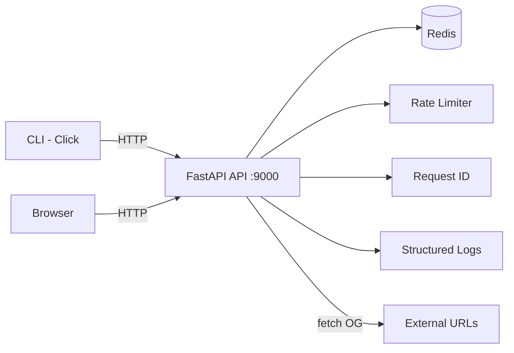

[](https://github.com/websensa/url-shortener-task-python-JakubPrejzner/actions/workflows/ci.yml)

# URL Shortener

A production-ready URL shortening service with click analytics, OpenGraph previews, and rate limiting. Built with FastAPI, Redis, and Click.

## Architecture



## Quick Start

```bash
docker compose up --build
```

Once running:

- **API** — http://localhost:9000
- **Health check** — http://localhost:9000/health
- **Shorten a URL** — `POST http://localhost:9000/shorten`
- **Preview a link** — http://localhost:9000/!{code}

## API Endpoints

| Method | Path | Description |
|--------|------|-------------|
| `POST` | `/shorten` | Create short URL (with optional `ttl_seconds`) |
| `GET` | `/{code}` | Redirect to original URL (301) |
| `GET` | `/!{code}` | Rich OpenGraph preview card |
| `GET` | `/stats/{code}` | Click analytics and referrer data |
| `GET` | `/health` | Health check (API + Redis) |

### Examples

**Shorten a URL:**

```bash
curl -X POST http://localhost:9000/shorten \
  -H "Content-Type: application/json" \
  -d '{"url": "https://example.com"}'
```

```json
{
  "short_url": "http://localhost:9000/AbC12x",
  "short_code": "AbC12x",
  "original_url": "https://example.com/"
}
```

**Shorten with TTL (expires in 1 hour):**

```bash
curl -X POST http://localhost:9000/shorten \
  -H "Content-Type: application/json" \
  -d '{"url": "https://example.com", "ttl_seconds": 3600}'
```

**Redirect:**

```bash
curl -L http://localhost:9000/AbC12x
```

**Preview:**

```bash
curl http://localhost:9000/'!AbC12x'
```

**Stats:**

```bash
curl http://localhost:9000/stats/AbC12x
```

## CLI Usage

The CLI communicates directly with Redis (not through the API).

```bash
# Shorten a URL
python -m cli.main add https://example.com

# Shorten with a 1-hour TTL
python -m cli.main add --ttl 3600 https://example.com

# Update where a short code points
python -m cli.main update AbC12x https://new-target.com

# Delete a short URL
python -m cli.main delete AbC12x
```

## Configuration

All settings are read from environment variables (or a `.env` file). See `.env.example` for defaults.

| Variable | Default | Description |
|----------|---------|-------------|
| `REDIS_HOST` | `localhost` | Redis hostname |
| `REDIS_PORT` | `6379` | Redis port |
| `REDIS_DB` | `0` | Redis database index |
| `API_HOST` | `0.0.0.0` | API listen address |
| `API_PORT` | `9000` | API listen port |
| `SHORT_URL_MAX_LEN` | `6` | Length of generated short codes |
| `BASE_URL` | `http://localhost:9000` | Base URL used in shortened link responses |
| `RATE_LIMIT_ENABLED` | `true` | Enable/disable per-IP rate limiting |
| `RATE_LIMIT_MAX_REQUESTS` | `60` | Max requests per window per IP |
| `RATE_LIMIT_WINDOW_SECONDS` | `60` | Rate limit sliding window in seconds |
| `LOG_FORMAT` | `text` | Log output format (`text` or `json`) |
| `LOG_LEVEL` | `INFO` | Python logging level |

## Development

### Prerequisites

- Python 3.11+
- Redis (or `docker run -d -p 6379:6379 redis:7-alpine`)

### Setup

```bash
python -m venv .venv
source .venv/bin/activate        # Windows: .venv\Scripts\activate
pip install -r requirements.txt -r requirements-dev.txt
cp .env.example .env
```

### Makefile Targets

| Target | Description |
|--------|-------------|
| `make install` | Install all dependencies |
| `make lint` | Run ruff linter |
| `make format` | Format code with ruff |
| `make typecheck` | Run mypy (strict mode) |
| `make test` | Run tests with verbose output |
| `make test-cov` | Run tests with coverage report |
| `make run` | Start uvicorn dev server (port 9000, auto-reload) |
| `make docker-up` | Build and start containers |
| `make docker-down` | Stop containers and remove volumes |
| `make clean` | Remove build and cache artifacts |

### Running Tests

```bash
pytest -v                                       # all tests
pytest --cov --cov-report=term-missing          # with coverage
```

### Linting and Type Checking

```bash
ruff check .          # lint
ruff format .         # format
mypy app cli          # type check (strict)
```

## Design Decisions

**Redis as the data store.** Redis provides sub-millisecond reads, atomic `SET NX` for collision-free code generation, built-in TTL expiration for time-limited links, and sorted sets for time-windowed click analytics. For a URL shortener where every redirect must be fast and data is inherently key-value shaped, Redis is a natural fit that avoids the overhead of a relational or document database.

**Service layer with dependency injection.** Business logic lives in `app/services/`, completely decoupled from HTTP concerns. Route handlers receive a Redis client through FastAPI's `Depends()` mechanism, making the service functions easy to test with a fake Redis implementation and easy to swap for a different storage backend without touching the API layer.

**Idempotent URL shortening.** Submitting the same URL twice returns the same short code. A reverse index (`url:{url} -> code`) ensures deduplication without scanning. This prevents database bloat from repeated submissions and gives clients a stable, predictable short link for any given URL.

**OpenGraph preview with caching.** The `/!{code}` endpoint fetches OpenGraph metadata from the target URL and renders a rich preview card. Results are cached in Redis for one hour to avoid repeated outbound requests and to keep preview responses fast, even when the target site is slow or temporarily unreachable.

**Structured logging with request correlation IDs.** Every request is tagged with a unique `X-Request-ID` (generated or forwarded from the client). Logs include the request ID, method, path, status code, and response time. Setting `LOG_FORMAT=json` produces machine-parseable output suitable for log aggregation pipelines.

For full rationale and tradeoff analysis, see the [Architecture Decision Records](docs/adr/).
