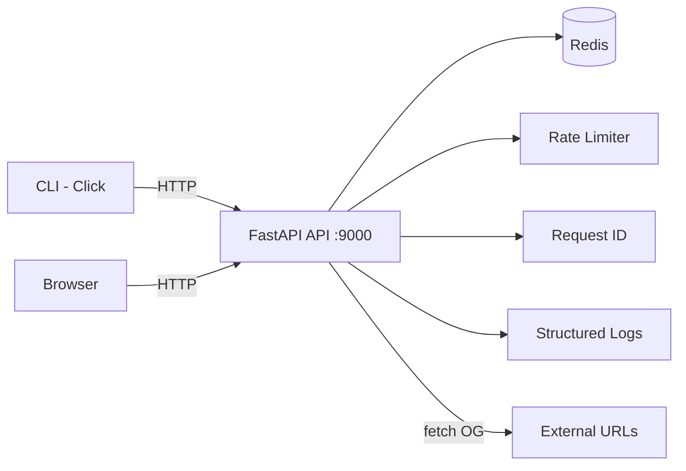

# URL Shortener API

A production-grade REST API for URL shortening with click analytics, OpenGraph previews, and rate limiting. Built with **FastAPI**, **Redis**, and **Docker Compose**.

## Features

- **URL Shortening** — idempotent short code generation with configurable length
- **301 Redirects** — sub-millisecond lookups via Redis
- **Click Analytics** — per-link stats with 24h/7d windows and referrer tracking
- **OpenGraph Previews** — rich preview cards with metadata caching
- **Rate Limiting** — per-IP sliding window with standard headers
- **TTL Support** — time-limited links with automatic expiration
- **CLI Tool** — manage URLs directly from the terminal
- **Structured Logging** — request correlation IDs, JSON or text output
- **38 Automated Tests Passing** — API, service, and CLI layers fully covered

## Tech Stack

| Layer | Technology |
|-------|-----------|
| API Framework | FastAPI |
| Data Store | Redis 7 |
| Containerization | Docker Compose |
| Language | Python 3.11+ |
| CLI | Click |
| Testing | pytest + pytest-asyncio |
| Linting | Ruff, Mypy (strict) |
| CI/CD | GitHub Actions |

## Quick Start

```bash
docker compose up --build
```

The API is available at **http://localhost:9000**.

## API Endpoints

| Method | Path | Description |
|--------|------|-------------|
| `POST` | `/shorten` | Create short URL (with optional `ttl_seconds`) |
| `GET` | `/{code}` | Redirect to original URL (301) |
| `GET` | `/!{code}` | Rich OpenGraph preview card |
| `GET` | `/stats/{code}` | Click analytics and referrer data |
| `GET` | `/health` | Health check (API + Redis) |

### Examples

**Shorten a URL:**

```bash
curl -X POST http://localhost:9000/shorten \
  -H "Content-Type: application/json" \
  -d '{"url": "https://example.com"}'
```

```json
{
  "short_url": "http://localhost:9000/AbC12x",
  "short_code": "AbC12x",
  "original_url": "https://example.com/"
}
```

**Shorten with TTL (expires in 1 hour):**

```bash
curl -X POST http://localhost:9000/shorten \
  -H "Content-Type: application/json" \
  -d '{"url": "https://example.com", "ttl_seconds": 3600}'
```

**Redirect:**

```bash
curl -L http://localhost:9000/AbC12x
```

**Preview:**

```bash
curl http://localhost:9000/'!AbC12x'
```

**Stats:**

```bash
curl http://localhost:9000/stats/AbC12x
```

## CLI Usage

The CLI communicates directly with Redis (not through the API).

```bash
python -m cli.main add https://example.com           # shorten a URL
python -m cli.main add --ttl 3600 https://example.com # with 1-hour TTL
python -m cli.main update AbC12x https://new-url.com  # update target
python -m cli.main delete AbC12x                      # delete short URL
```

## Architecture



## Configuration

All settings are read from environment variables (or a `.env` file). See `.env.example` for defaults.

| Variable | Default | Description |
|----------|---------|-------------|
| `REDIS_HOST` | `localhost` | Redis hostname |
| `REDIS_PORT` | `6379` | Redis port |
| `REDIS_DB` | `0` | Redis database index |
| `API_HOST` | `0.0.0.0` | API listen address |
| `API_PORT` | `9000` | API listen port |
| `SHORT_URL_MAX_LEN` | `6` | Length of generated short codes |
| `BASE_URL` | `http://localhost:9000` | Base URL in shortened link responses |
| `RATE_LIMIT_ENABLED` | `true` | Enable/disable per-IP rate limiting |
| `RATE_LIMIT_MAX_REQUESTS` | `60` | Max requests per window per IP |
| `RATE_LIMIT_WINDOW_SECONDS` | `60` | Rate limit sliding window in seconds |
| `LOG_FORMAT` | `text` | Log output format (`text` or `json`) |
| `LOG_LEVEL` | `INFO` | Python logging level |

## Development

See [DEVELOPMENT.md](DEVELOPMENT.md) for setup instructions, project structure, and contribution guidelines.

## Design Decisions

Detailed rationale is documented in [Architecture Decision Records](docs/adr/):

- [ADR-001: Redis Over MongoDB](docs/adr/001-redis-over-mongodb.md)
- [ADR-002: Idempotent URL Shortening](docs/adr/002-idempotent-url-shortening.md)
- [ADR-003: OpenGraph Preview With Cache](docs/adr/003-og-preview-with-cache.md)
- [ADR-004: Rate Limiting Strategy](docs/adr/004-rate-limiting-strategy.md)

## License

MIT
